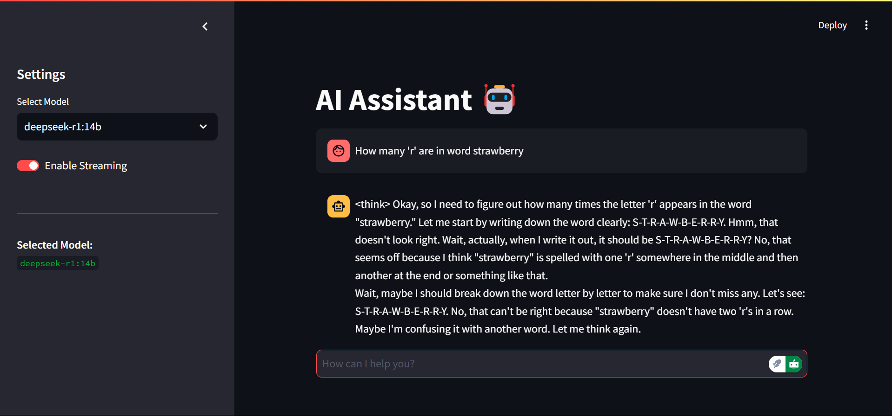

# OLLAMA CHAT



ChatGPT-like AI Assistant powered by Ollama, built with FastAPI and Streamlit.

## Features

- FastAPI backend, Streamlit frontend
- ChatGPT-like chat
- Real-time streaming
- Multiple Ollama model support
- Sidebar configuration, Session persistence

## Prerequisites

- Python >= 3.10
- [Ollama](https://ollama.com/) installed and running
- Ollama model pulled (e.g., `llama3.2:latest`)

## Installation

1.  **Clone:** `git clone https://github.com/Ashwin-ER/ollama_fastapi.git && cd OLLAMA_CHAT`

2.  **Backend:**
    ```bash
    cd backend
    python -m venv venv && source venv/bin/activate  # Or: venv\Scripts\activate
    pip install -r requirements.txt
    ```

3.  **Frontend:**
    ```bash
    cd ../frontend
    python -m venv venv && source venv/bin/activate  # Or: venv\Scripts\activate
    pip install -r requirements.txt
    ```

## Configuration

1.  **Ollama:**
    ```bash
    ollama serve # Start in separate terminal
    ollama pull llama3.2:latest
    ```

2.  **.env files:**

    **backend/.env**
    ```env
    OLLAMA_HOST=http://localhost:11434 # or your Ollama URL
    ```

    **frontend/.env**
    ```env
    BACKEND_URL=http://localhost:8000
    ```

## Usage

1.  **Backend:** `cd backend && uvicorn app.main:app --reload`
2.  **Frontend:** `cd frontend && streamlit run app.py`

**Access:**
- Frontend: [http://localhost:8501](http://localhost:8501)
- Backend API: [http://localhost:8000](http://localhost:8000)
- Ollama: [http://localhost:11434](http://localhost:11434)

## Tech Stack

- **Backend:** FastAPI, Ollama Python Client, CORS
- **Frontend:** Streamlit, Requests
- **AI:** Ollama, LLMs (Llama3, etc.)

## Troubleshooting

- **Ollama not running:**  Verify `ollama serve` and `OLLAMA_HOST`
- **Model not found:** `ollama pull <model-name>`
- **CORS Errors:** Check frontend/backend URLs

## Contributing

Fork, branch, commit, push, PR.

## License

MIT License
